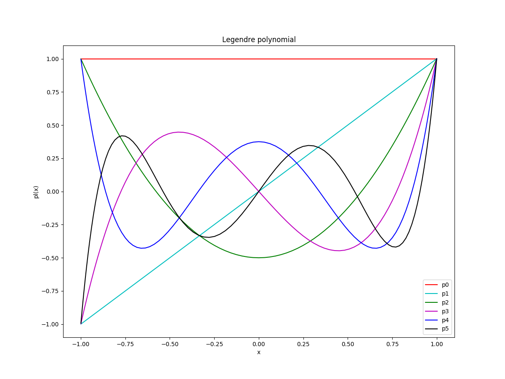
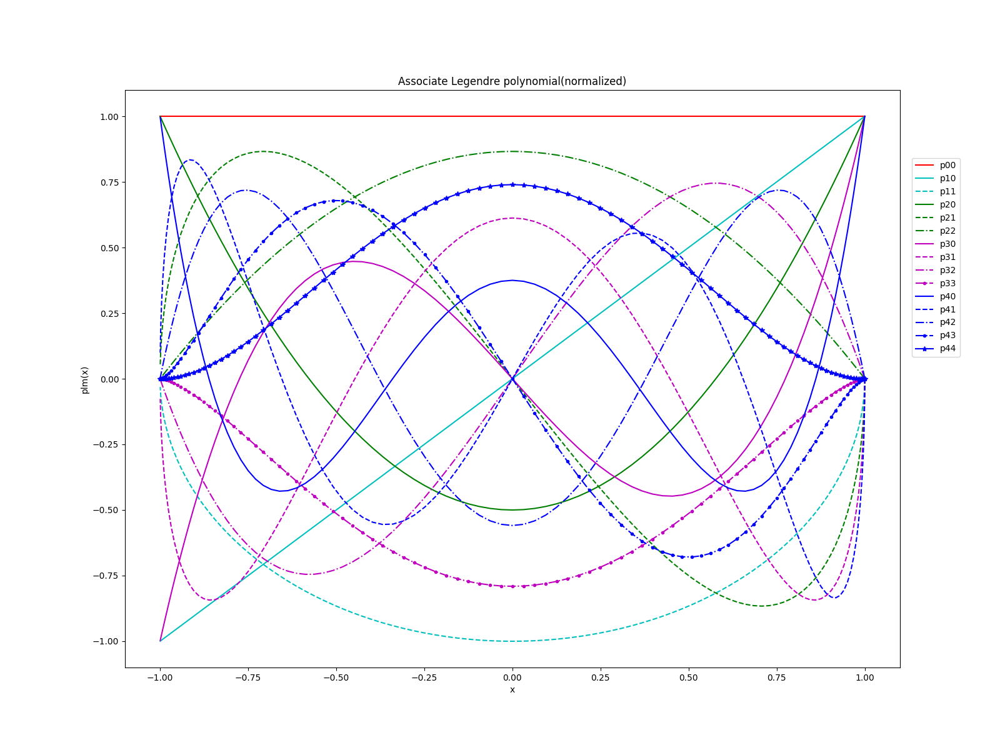

# 球谐函数模块 [sh_value](./src/lib/sh_value.f90)

通过 f2py 可以将 fortran 模块生成动态链接库，直接在 python 中使用。通过以下命令生成动态库 **sh.so**, 然后在 pyhton 使用该模块，并对该模块进行验证。
>f2py -c sh_value.f90 -m sh

## 勒让得多项式
通过 [plot_pl](./tools/plot_pl.py) 画出勒让得多项式的图像对其进行验证

- LegendrePolynomial
  

## 连带勒让得多项式
通过 [plot_plm](./tools/plot_plm.py) 画出连带勒让得多项式的图像对其进行验证
- AssociateLegendrePolynomial
  

## 球谐函数
通过 [plot_ylm](./tools/plot_ylm.py) 画出球谐函数的图像对其进行验证
- SphericalHarmonics
  
